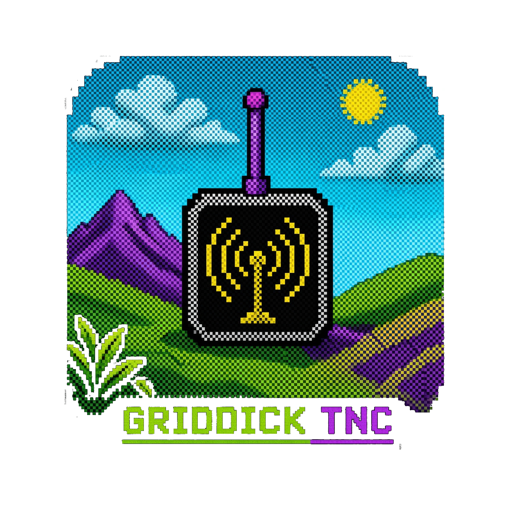
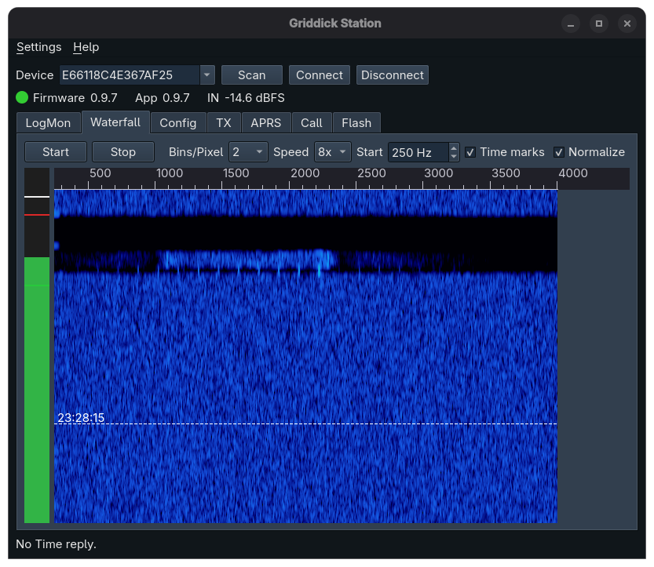
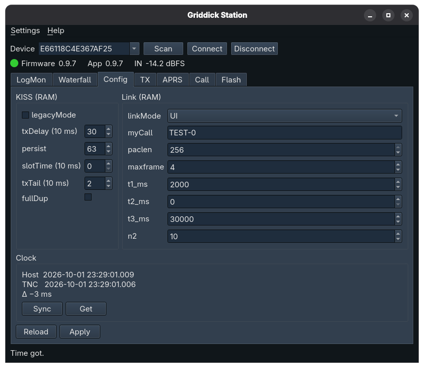

<div align="center">
  
  <h1>Griddick TNC</h1>
  <p>
    Extended KISS TNC for RPi Pico • AX.25 packet radio • 1200 bps<br>
    Host CLI and Qt app • IP/UDP gate • 240 kHz ADC • 120 kHz PWM DAC<br>
    Off-Grid comms • City-prepping • BBS
  </p>
</div>

Griddick is a compact packet-radio modem built for the case when the usual paths are down and it's time to go off-grid.

Grab a cheap FM handheld (TYT, Baofeng, whatever), an RPi Pico. The firmware throws AX.25 frames on the air and talks KISS over USB serial. Any KISS-speaking app can drive it in Legacy KISS mode. Extended KISS mode lets you feed .wav files into the TNC and decode them, obtain a raw PCM stream, get/put JSON configuration, monitor logs etc. The extended mode host applications are included.

Every DSP algorithm runs on the Pico, integer math only. Hand-rolled filters let this TNC copy up to 59% more AX.25 frames than Direwolf 1.8.1 from the same signal - even when the SNR is very low. Tests are in the repo, anyone can repeat them on a stock Pico RP2040 - no soldering needed to assess and decide whether the circuit is worth building.

<p align="center">
<br>
<i>Griddick Station tool is displaying waterfall in real time, a packet on the way in.</i>
</p>

<p align="left">

## Properties

| Item | Description |
|:---|:---|
| Board | Raspberry Pi Pico, RP2040 / 180 MHz. |
| Modem | Bell 202 AFSK. 1200 baud. Tones 1200 Hz and 2200 Hz. |
| Receive | 240 kHz, 12-bit ADC, decimated to 48 kHz. DSP RX hotpath runs at 48 kHz sample rate. |
| Transmit | 12 kHz PWM audio, one GPIO for PTT. TX delay and tail are flags, in the usual 10 ms KISS units. |
| On the air | AX.25 UI/I/SABM frames. Connected mode in gtcall/CLI and gtstation/Qt. |
| IP/UDP | griddickd service creates tun interface and performs udp packets bridging over AX.25 |
| APRS | Works with APRS packets. |
| Host link | KISS over USB CDC - with extensions by default. Legacy mode can activated to be fully compartible to a vanilla KISS TNC. |
| Bit repair | F1 mode repairs 1 wrong bit, if that is possible. On the air the search is sliced so RX keeps running. F0 is the same demodulator with that repair off. |
| Noise injector| A reference additive noise generator is implemented on the TX side of the Pico. It injects AWGN into the TX signal right before the DAC to assess frame-decoding stability under various ornery conditions. Optional. |
| Auth | Optional packet authentication check (16-bit digest). Being enabled, keeps the impostors out: the packet must hail from a callsign in your address book. Trust, but verify. Disabled in vanilla TNC mode. |
| Settings | JSON over KISS SET-HW. A successful put is stored in a flash journal incrementally, preventing flash aging. |
| Host | Debian and Fedora. Command-line tools, the Griddick Station Qt, and an IP/UDP gateway daemon. |
| Licence | LGPL-2.1-or-later, except two tiny DSP units shipped as a prebuilt lib for Pico. |

</p>

## Results of testing

The comparison with Direwolf is a host replay. A second, live-air run checked that the Pico path behaves the same when operation over the air.

### Griddick TNC/Pico against Direwolf/Linux

Testing was performed with Griddick TNC, Pico firmware V0.9.7, and Direwolf atest V1.8.1 on Fedora 44. One hundred WAV files were used per SNR slot. The WAV files were generated by `gen_packets` from Direwolf V1.8.1, and then AWGN was added. Each file was fed to the Pico via `gtfeed` and scored. It was then fed to Direwolf `atest` and scored again. Finally, the two scores were compared.

Direwolf was `atest -B 1200 -F 1` and `-F 0`, so the single-bit repair is on in F1 chart and off in F0 chart. The SNR values shown in these figures are computed over the 300–3000 Hz voice band, i.e., signal and noise powers are integrated over that band.

<p align="center">


</p>

<p align="center">

| SNR, dB | Griddick F1 | Direwolf F1 | Griddick F0 | Direwolf F0 |
|---:|---:|---:|---:|---:|
| 3.00 | 2 | 0 | 0 | 0 |
| 3.25 | 11 | 4 | 1 | 1 |
| 3.50 | 10 | 3 | 2 | 1 |
| 3.75 | 14 | 10 | 6 | 1 |
| 4.00 | 43 | 27 | 19 | 8 |
| 5.00 | 80 | 75 | 53 | 39 |
| 6.00 | 95 | 93 | 80 | 72 |
| 7.00 | 98 | 97 | 96 | 92 |
| 8.00 | 99 | 100 | 98 | 99 |

</p>

&nbsp;
### On the air, Griddick F1 against F0

To put a stack of demodulation algorithms through their paces, Griddick comes loaded with a reference additive white Gaussian noise (AWGN) generator. For this run, I enabled it by setting `"txAwgnInject": true` in the JSON settings file, and swept `"txAwgnSNRdB"` across a range of SNR levels, transmitting 100 packets of the same length per SNR bin. Two Picos (firmware V0.9.7), one transmitting packets laced with noise, the other receiving. F1 and F0.

F1 stayed well ahead of F0, tracing the same shape as the replay while the repair search ran in real time. The main goal was to make sure the bit-repairing algorithm (F1 mode) has enough juice to run on the Pico without side effects such as ADC ring-buffer overflow or dropped packets.


## What you get

Firmware builds to a UF2. Flash by copying it onto the RPI-RP2 drive. Host tools land in `host/bin`.

<p align="left">

| Tool | Type | Description |
|:---|:---|:---|
| `gttx` | Cmd | Send a UI frame, an APRS position, status, or message, or one I-frame under ARQ. `--every` key runs beacons until Ctrl-C. |
| `gtdump` | Cmd |  Print decoded KISS data. Sets the Pico clock first, unless asked not to. |
| `gtcall` | Cmd |  Connected mode. Listen, or call a peer, line at a time. |
| `gtcfg` | Cmd |  Read and write the JSON settings. |
| `gtlog` | Cmd |  Firmware event log. |
| `gttime` | Cmd |  Clock sync to match TNC local time with Host. |
| `gtfeed` | Cmd |  Feed a WAV into the TNC demodulator over USB serial to assess RX efficiency. |
| `gtwav` | Cmd |  Performs capture and write 48 kHz PCM wav. |
| `gtstation` | QtApp |  Qt Station: waterfall (analog/ADC signal-chain quality assessment, not for RX), send/receive, call, APRS, configuration, .uf2 flashing. |
| `griddickd` | Svc |  UDP-only TUN to AX.25 gateway service. Not required for KISS use. |

</p>

&nbsp;
<p align="center">
<br>
<i>Griddick Station Qt app, config tab. JSON in the editor, last time sync on the status line.</i>
</p>


## Radio interface

I have intentionally avoided complicated schematics. The following circuit is as simple as possible for the task. Therefore, it can be easily built even by a garage tinkerer. It was tested on the TYT TH-UV98/99, MD-619, TD-5508, Baofeng UV-5R, UV-25. No issues were observed; THD was approx. -20 dB. This matters for the upcoming modes, which require signal-path linearity.

Important notice: The squelch (SQL) should be open during operation. Enabling SQL requires experimentally increasing the preamble length due to the squelch open delay. I would not recommend enabling SQL under challenging conditions.

ADC interface.
```text
                                 ADC_VREF (Pico pin 35)
                                    │
                                   [3k]
                                    │
 ●─radio SPK ───── 0,1µ───[4k3]─────●────► GPIO28 / ADC2
   (3.5 mm jack tip)                │           (pin 34)
                                   [3k]
                                    │
                                 AGND (pin 33)

 ●─radio SPK GND (3.5 mm jack sleeve)             
          │                   
       AGND (pin 33)
```

DAC interface.

```text
 GPIO0 ──[3k6]──●────0,1µ─────radio MIC─────────●
 (pin 1)        │             (3.5 mm jack ring)
              [0,1µ]
                │
               GND
```

PTT on/off.
```text
                   ┌── o/coup ──┐
 GPIO18───[330R]───│ A       C  │────●───────radio PTT─●
 (pin 24)          │    4N35    │    │ (2.5 mm j.sleeve)
             GND ──│ K       E  │    │
                   └────────────┘  [0,1µ]
                             │       │
                            GND     GND

```


## Status and licence

Version 0.9.7

© 2026 Roman Piksaykin, piksaykin@gmail.com, amateur radio enthusiast,
https://www.qrz.com/db/R2BDY.

Source is LGPL-2.1-or-later. The licence text is at <https://www.gnu.org/licenses/lgpl-2.1.html>.
